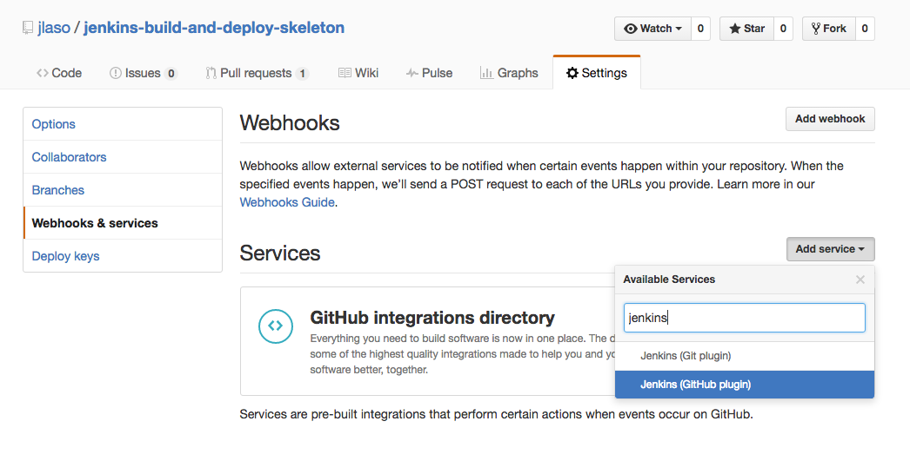
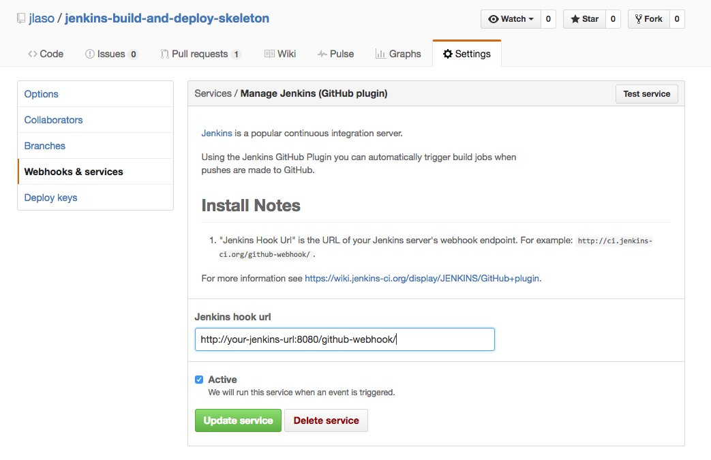
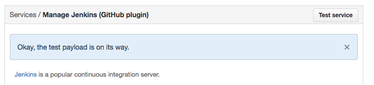

# jenkins-build-and-deploy-skeleton

Just a proof on concept to check jenkins configuration

## This is only a pure test in order to check if all Jenkins setup works fine

## Instalation process

create the webhook on github

### Step 1

### Step 2

### Step 3

